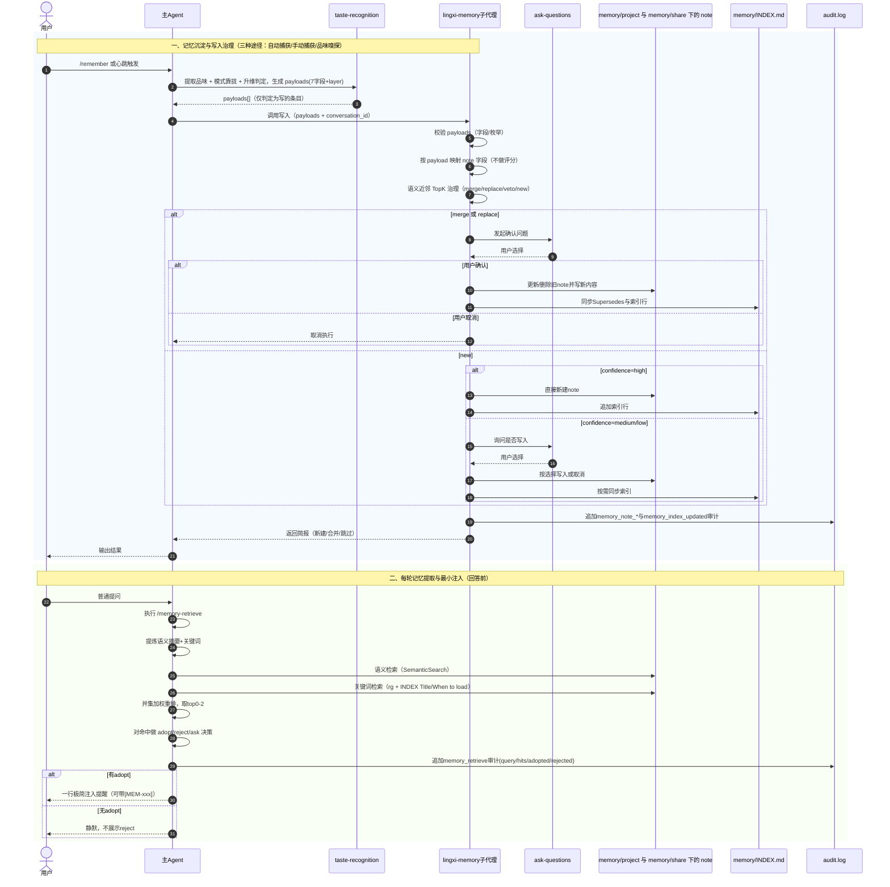

# 记忆系统

记忆系统是灵犀的核心能力——让 AI **在项目中学习你的判断力、品味和责任感**，并在每轮新对话中自然复用。

## 工作原理

记忆系统包含**检索**与**写入**两方面：

- **检索（每轮）**：对话开始时自动从记忆库取出最相关笔记并注入上下文，供 AI 带着你的「经验」回答。
- **写入（三种途径）**：记忆通过自动捕获（心跳会话提炼）、手动捕获（/remember、/init）、品味嗅探（工作流内置）进入记忆库；详见下文 [记忆写入](#记忆写入)。

每轮对话中的检索流程可简化为：

```
对话开始
  ↓
自动检索记忆（memory-retrieve）
  ↓
注入 0–2 条最相关记忆
  ↓
AI 带着你的"经验"回答
```

## 记忆检索

每轮对话前，灵犀自动执行 `memory-retrieve`，从记忆库中检索最相关的笔记：

- **双路径检索**：语义搜索 + 关键词匹配，并集加权合并
- **最小注入**：只取 top 0–2 条，避免上下文污染

## 记忆写入

记忆写入有三种途径：**自动捕获**（心跳触发的会话提炼）、**手动捕获**（/remember、/init 等）、**品味嗅探**（工作流内置）。

### 自动捕获：心跳会话提炼

灵犀在**新会话开始时**会检查：若距上次会话提炼已超过 30 分钟，则自动入队最多 3 个已完结、尚未提炼的会话，由后台 **lingxi-session-distill** 子代理异步获取会话内容、经 taste-recognition 提炼并写入记忆（payload 的 source=heartbeat）。主会话无需等待，提炼在后台完成。你可在 `.cursor/.lingxi/workspace/audit.log` 中查看 `heartbeat.triggered`、`heartbeat.distillation_completed` 等事件。

### 手动捕获：/remember 与 /init

| 命令/机制        | 用途                                                                                   |
| ---------------- | -------------------------------------------------------------------------------------- |
| **/remember**    | 即时写入：从当前输入（可结合对话上下文）提取记忆并写入                                 |
| **/init**        | 初始化时可选写入：引导收集项目信息后先生成记忆候选清单，仅在你明确选择后才写入         |

示例：`/remember 吸取刚才这个 bug 的经验`、`/remember 始终使用 pnpm 而不是 npm`。  
/init 为项目初始化时的可选写入，非常规捕获路径。

**门控**：合并或替换已有记忆时需要你确认；新建记忆在 confidence 为 high 时可静默写入，medium/low 时需确认。

### 品味嗅探：工作流内置

在 task / plan / build / review 等 **Skill** 环节中，当情境需要时，灵犀会通过 ask-questions 收集你的选择，经 taste-recognition 产出 payload（`source=choice`）并写入记忆，无需你额外执行命令。

## 记忆的结构

每条记忆对应 taste-recognition 产出的**扩展 payload**（7 个业务字段 + **layer**），lingxi-memory 仅接受 **payloads 数组**。字段定义与识别边界见 [开发者品味](/guide/how-to-recognize-developer-taste)：

| 字段       | 含义     |
| ---------- | -------- |
| scene      | 适用场景 |
| principles | 核心原则 |
| choice     | 具体选择 |
| evidence   | 支撑证据 |
| source     | 来源     |
| confidence | 置信度   |
| apply      | 是否进入 share（`project` \| `team`） |
| layer      | 层级（`L0` \| `L1` \| `L0+L1`，由 taste-recognition 升维判定填写） |

## 索引同步与主动治理

使用 **/memory-govern** 可保持 INDEX 与 `memory/project/`、`memory/share/` 一致，并可选择执行主动治理：

- **同步**：脚本会删除孤儿索引行（INDEX 中有但对应 note 文件已不存在），并检测未索引的 note；再由模型为每条未索引 note 生成 INDEX 行，保证检索准确。
- **主动治理（可选）**：模型可对整库提出合并/改写/归档等建议；仅在你通过 ask-questions 确认后才写回。

在添加或更新共享记忆后（例如执行 `git submodule update` 后），或在希望整理索引并获取治理建议时，在 Cursor 中运行 `/memory-govern` 即可。无需单独执行 Node.js 脚本。详见 [命令参考 — /memory-govern](/guide/commands-reference#memory-govern)。

## 记忆治理

灵犀的记忆治理是一套 **“写入治理 + 检索治理 + 审计治理”** 的闭环，目标是持续沉淀高价值经验，同时控制噪音与风险。

### 1) 写入前治理（质量门槛）

- **taste-recognition** 在识别可沉淀内容后，会先做**模式靠拢**（参考设计模式目录），再做**升维判定**（D1 决策增益、D2 可复用/可触发、D3 可验证性、D4 稳定性，每维 0～2 分，总分 T）。仅当 T≥4 且未触犯例外时，才产出该条 payload 并标注 layer（L0/L1/L0+L1）；T≤3 或触犯例外时不产出该条，主 Agent 也不会因此条调用 lingxi-memory。
- 因此只有通过升维判定的条目才会进入 **payloads 数组**；**lingxi-memory** 不执行评分或升维，校验后调用 **memory-write** skill 执行：按 payload 映射生成 note → 语义近邻 TopK 治理（merge/replace/veto/new）→ 门控 → 写入 memory/project/、memory/share/ 与 INDEX。
- 关于 taste-recognition 的职责边界与常见误区，见 [开发者品味](/guide/how-to-recognize-developer-taste)。

### 2) 去重与冲突治理（语义近邻 TopK）

- 对 `memory/project/`、`memory/share/` 执行语义近邻检索（TopK）后，按 `merge / replace / veto / new` 四类动作决策。
- 发生合并或替换时维护 `Supersedes` 关系，并同步更新 `INDEX`，保证演进链条可追踪。
- 具体治理逻辑与门控由 **lingxi-memory** 子代理执行，详见 [记忆治理与写入](/guide/memory-governance-and-write)。

### 3) 用户门控（不可绕过）

- `merge / replace` 必须通过 ask-questions 征得确认。
- `new` 仅在 `confidence=high` 时可静默写入；`medium/low` 必须确认。
- 涉及删除或替换的操作一律需要用户确认，不可绕过。

### 4) 检索侧治理（每轮最小注入）

- 每轮回答前执行 `memory-retrieve`，流程为：**理解 → 提炼 → 双路径检索（语义 + 关键词）→ top 0-2 → adopt/reject/ask 决策**。
- 仅对 adopt 结果做“一行最小注入”，reject 结果不向用户展示，控制上下文污染。

### 5) 结构治理（SSoT）

- `INDEX.md` 只存最小元数据，作为权威索引（SSoT）。
- 真实语义内容保存在 `memory/project/*.md`、`memory/share/*.md`。
- 支持 `active / local / archive` 生命周期分层，以及 **memory/share** 目录的跨项目复用。

### 6) 审计治理

- 记忆检索与记忆写入都会写入审计事件到 `.cursor/.lingxi/workspace/audit.log`。
- 审计日志用于追溯 query、命中结果、采纳决策与写入动作，便于排错与合规审查。

更多实现细节见主仓 [lingxi-memory](https://github.com/tower1229/LingXi/blob/main/.cursor/agents/lingxi-memory.md) 与 [memory-write](https://github.com/tower1229/LingXi/blob/main/.cursor/skills/memory-write/SKILL.md)；官网专题见 [记忆治理与写入](/guide/memory-governance-and-write)。

### 治理时序图（从写入到检索注入）



## 跨项目共享

团队可以通过 **git submodule** 共享记忆库，让最佳实践在所有项目中流转。

### 设置共享仓库

添加或更新共享记忆仓库后，在 Cursor 中运行 **/memory-govern** 即可同步 INDEX 与 project/share（并可选择执行主动治理）。无需单独执行 Node.js 脚本。若项目尚未安装灵犀，请先完成 [快速开始](/guide/quick-start)。

```bash
# 1. 添加共享记忆仓库
git submodule add <shareRepoUrl> .cursor/.lingxi/memory/share

# 2. 更新共享记忆
git submodule update --remote --merge

# 3. 同步记忆索引与可选治理：在 Cursor 中运行 /memory-govern
```

### 共享规则

- **共享目录**：`.cursor/.lingxi/memory/share/`
- **识别标准**：payload 的 `apply` 为 `team` 的记忆可放入 **memory/share** 跨项目复用，为 `project` 的仅当前项目（memory/project）。
- **优先级**：项目记忆覆盖共享记忆（相同主题时）

## 下一步

- 回顾 [核心工作流](/guide/core-workflow) 了解记忆如何融入开发流程
- 阅读 [开发者品味](/guide/how-to-recognize-developer-taste) 了解 taste-recognition 的识别契约
- 阅读 [记忆治理与写入](/guide/memory-governance-and-write) 了解 lingxi-memory 的治理与写入流程
- 访问 [GitHub 仓库](https://github.com/tower1229/LingXi) 查看完整源码
