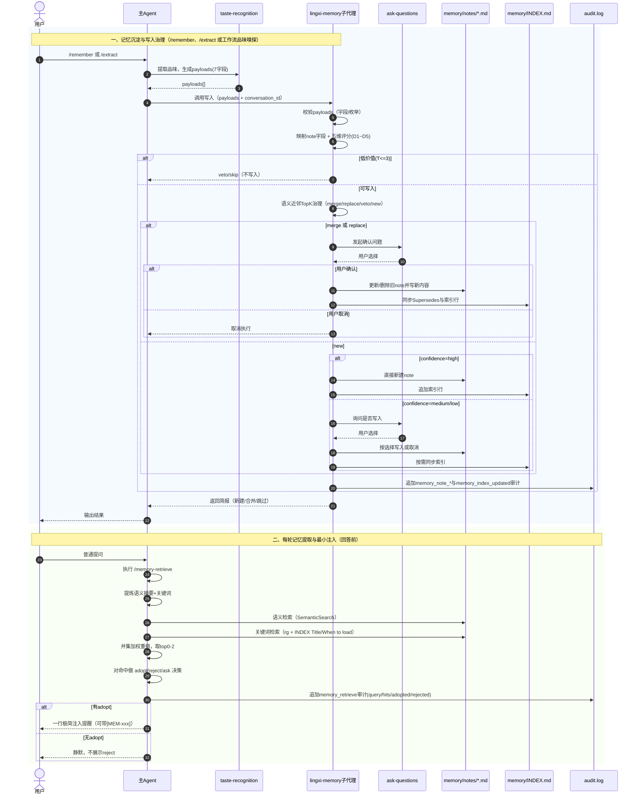

# 记忆系统

记忆系统是灵犀的核心能力——让 AI **在项目中学习你的判断力、品味和责任感**，并在每轮新对话中自然复用。

## 工作原理

```
对话开始
  ↓
自动检索记忆（memory-retrieve）
  ↓
注入 0–3 条最相关记忆
  ↓
AI 带着你的"经验"回答
```

## 记忆检索

每轮对话前，灵犀自动执行 `memory-retrieve`，从记忆库中检索最相关的笔记：

- **双路径检索**：语义搜索 + 关键词匹配，并集加权合并
- **最小注入**：只取 top 0–3 条，避免上下文污染
- **优雅降级**：语义搜索不可用时降级为纯关键词，仍无匹配则静默跳过

## 记忆写入

记忆写入**仅由用户或工作流环节触发，不会自动执行**。沉淀来源有两类：

1. **主动记忆捕获**：使用 **/remember** 与 **/extract**；**/init** 属于初始化流程中的可选写入（先生成候选，仅在你明确选择后才写入）。
2. **工作流内置品味嗅探**：在 task / plan / build / review 等环节中，当情境需要时，灵犀会通过 ask-questions 收集你的选择，经 taste-recognition 产出 payload（`source=choice`）并写入记忆，无需你额外执行命令。

主 Agent 先经 taste-recognition 产出结构化 payload，再以 **payloads 数组**调用 lingxi-memory 子代理；子代理完成校验、映射、治理与门控后直接写入 notes 与 INDEX，并向主对话返回**简报**（新建/合并/跳过条数及 Id 列表）。想了解 taste-recognition 如何识别“品味”并形成 7 字段契约，见 [开发者品味](/guide/how-to-recognize-developer-taste)。

### 主动记忆捕获

| 命令          | 用途                                                                                   |
| ------------- | -------------------------------------------------------------------------------------- |
| **/remember** | 即时写入：从当前输入（可结合对话上下文）提取记忆并写入                                 |
| **/extract**  | 按会话或时间范围提取：对当前会话或指定时间范围内的对话做可沉淀提取，批量写入并得到简报 |

二者为日常沉淀记忆的惯用入口；工作流中的品味嗅探则在你使用 task/plan/build/review 时在情境驱动下自动收集选择并写入，无需单独发命令。

### 初始化时可选写入

**/init** 在引导收集项目信息后，会先给出记忆候选清单；默认跳过写入，只有在你明确选择写入策略（如 all/partial）后，才会把确认的候选转为记忆。此为初始化流程的额外产物，非常规记忆捕获方式；若需在日常开发中写入记忆，请使用 **/remember** 或 **/extract**。

**门控**：合并或替换已有记忆时需要你确认；新建记忆在 confidence 为 high 时可静默写入，medium/low 时需确认。

### /remember — 即时记忆

你可以随时使用 `/remember` 主动写入记忆：

```
/remember <记忆描述>
```

**示例：**

```
/remember 吸取刚才这个 bug 的经验
/remember 始终使用 pnpm 而不是 npm
/remember 这个项目的 API 返回格式必须遵循 RESTful 规范
```

### /extract — 按会话或时间范围提取

对当前会话或指定时间范围内的对话做可沉淀内容提炼并写入记忆库。

**示例：**

```
/extract
/extract 提炼今天的会话
/extract 提炼最近2天的会话
/extract 1d
/extract 24h
```

- **不传参**：对**当前会话**提炼，适合在一轮对话结束后执行。
- **带参数**：接受自然语言时间范围（如「今天的会话」「最近 N 天」「Nd」「Nh」）；若解析不到有效时间范围会提示错误并终止。
  执行后灵犀会汇总对应会话内容、经 taste-recognition 提取多条 payload、单次传入 lingxi-memory，最后将简报呈现给你。识别规则与触发点见 [开发者品味](/guide/how-to-recognize-developer-taste)。

### 记忆的结构

每条记忆包含 7 个字段（由 taste-recognition 产出，lingxi-memory 仅接受 **payloads 数组**）。字段定义与识别边界见 [开发者品味](/guide/how-to-recognize-developer-taste)：

| 字段       | 含义     |
| ---------- | -------- |
| scene      | 适用场景 |
| principles | 核心原则 |
| choice     | 具体选择 |
| evidence   | 支撑证据 |
| source     | 来源     |
| confidence | 置信度   |
| apply      | 是否进入 share（`project` \| `team`） |

## 记忆治理

灵犀的记忆治理是一套 **“写入治理 + 检索治理 + 审计治理”** 的闭环，目标是持续沉淀高价值经验，同时控制噪音与风险。

### 1) 写入前治理（质量门槛）

- 先由 `taste-recognition` 产出标准 7 字段 `payloads`，再由 `lingxi-memory` 子代理执行校验与映射。
- 关于 taste-recognition 的职责边界与常见误区，见 [开发者品味](/guide/how-to-recognize-developer-taste)。
- 候选记忆进入五维评分卡（D1~D5，每维 0～2 分），总分 **T = D1 + D2 + D3 + D4 + D5**（满分 10 分），按规则决策：
  - **不写**：低价值候选直接 veto。
  - **写 L0（事实层）**：保留可验证的实例事实。
  - **写 L1（原则层）**：保留可复用的原则与策略。
  - **写 L0 + L1（双层）**：同时保留事实与原则。
- 评分维度、阈值与例外规则见 [五维评分卡](/guide/five-dimension-scorecard)。

### 2) 去重与冲突治理（语义近邻 TopK）

- 对 `notes/` 执行语义近邻检索（TopK）后，按 `merge / replace / veto / new` 四类动作决策。
- 发生合并或替换时维护 `Supersedes` 关系，并同步更新 `INDEX`，保证演进链条可追踪。

### 3) 用户门控（不可绕过）

- `merge / replace` 必须通过 ask-questions 征得确认。
- `new` 仅在 `confidence=high` 时可静默写入；`medium/low` 必须确认。
- 涉及删除或替换的操作一律需要用户确认，不可绕过。

### 4) 检索侧治理（每轮最小注入）

- 每轮回答前执行 `memory-retrieve`，流程为：**理解 → 提炼 → 双路径检索（语义 + 关键词）→ top 0-2 → adopt/reject/ask 决策**。
- 仅对 adopt 结果做“一行最小注入”，reject 结果不向用户展示，控制上下文污染。

### 5) 结构治理（SSoT）

- `INDEX.md` 只存最小元数据，作为权威索引（SSoT）。
- 真实语义内容保存在 `notes/*.md`。
- 支持 `active / local / archive` 生命周期分层，以及 `share` 目录的跨项目复用。

### 6) 审计治理

- 记忆检索与记忆写入都会写入审计事件到 `.cursor/.lingxi/workspace/audit.log`。
- 审计日志用于追溯 query、命中结果、采纳决策与写入动作，便于排错与合规审查。

更多实现细节见主仓 [lingxi-memory](https://github.com/tower1229/LingXi/blob/main/.cursor/agents/lingxi-memory.md)。

### 治理时序图（从写入到检索注入）



## 跨项目共享

团队可以通过 **git submodule** 共享记忆库，让最佳实践在所有项目中流转。

### 设置共享仓库

`memory-sync` 脚本由**灵犀安装脚本**在安装时写入项目的 `package.json`，请在**项目根目录**执行；需要本机已安装 Node.js。若项目尚未安装灵犀或未注入该脚本，请先完成 [快速开始](/guide/quick-start) 中的安装步骤。

```bash
# 1. 添加共享记忆仓库
git submodule add <shareRepoUrl> .cursor/.lingxi/memory/notes/share

# 2. 更新共享记忆
git submodule update --remote --merge

# 3. 同步记忆索引
npm run memory-sync
# 或
yarn memory-sync
```

### 共享规则

- **共享目录**：`.cursor/.lingxi/memory/notes/share/`
- **识别标准**：payload 的 `apply` 为 `team` 的记忆可放入 `notes/share` 跨项目复用，为 `project` 的仅当前项目。
- **优先级**：项目记忆覆盖共享记忆（相同主题时）

## 下一步

- 回顾 [核心工作流](/guide/core-workflow) 了解记忆如何融入开发流程
- 阅读 [开发者品味](/guide/how-to-recognize-developer-taste) 了解 taste-recognition 的识别契约
- 访问 [GitHub 仓库](https://github.com/tower1229/LingXi) 查看完整源码
